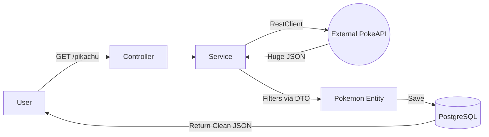

# 🦅 DexJava - Pokedex API Integration


## 📖 About the Project

**DexJava** is a RESTful API built with Spring Boot that acts as an intelligent persistence layer for the [PokeAPI](https://pokeapi.co/).

The main goal of this project was to apply advanced system integration concepts. Unlike a simple CRUD, this application consumes data from an external source (public API), filters and translates this information using the **DTO** (Data Transfer Object) pattern, and persists it into a relational database (**PostgreSQL**) for fast, offline access.

## ⚙️ Architecture & Data Flow

The project follows a strict layered architecture to ensure separation of concerns:

1.  **Controller:** Handles client requests.
2.  **Service (The Intelligence Layer):**
    * Queries the **PokeAPI** using the modern `RestClient`.
    * Receives raw data via a **DTO**, isolating the external structure from the internal domain.
    * Handles the mapping/translation to the **Entity** (Model).
3.  **Repository:** Persists the processed data into **PostgreSQL**.

### The "Search & Save" Flow:


## 🚀 Tech Stack
* Java 17
* Spring Boot 3.2 (Web, Data JPA)
* Spring Framework 6 (RestClient for API consumption)
* PostgreSQL (Relational Database)
* Lombok (Boilerplate reduction)
* Maven (Dependency Management)

## API Endpoints

### 1. Capture & Save Pokémon
Searches for a Pokémon in the external API by name. If found, 
it is automatically translated and saved to your local database.

>GET /api/pokemons/{name}

### Response Example(Clean JSON):
```
{
  "id": 25,
  "name": "pikachu",
  "mainAbility": "static",
  "baseXp": 112
}

````
### 2. List Pokedex
Returns all Pokémon that have been captured and saved in the local database.

>GET /api/pokemons/allpokemons

## How To Run

### Prerequisities

* Java JDK 17+
* PostgreSQL installed and running
* Maven

### Database configuration
Before running, connfigure your PostgreSQL credentials and database url in:
> src/main/resources/applictaion.properties

````
spring.datasource.url=jdbc:postgresql://localhost:5432/nameofyourdatabase_db
spring.datasource.username=your_username
spring.datasource.password=your_password
spring.jpa.hibernate.ddl-auto=update

````

### Runing the Application

````
# Clone the repository
git clone [https://github.com/D00cky/DexJava.git](https://github.com/D00cky/DexJava.git)

# Navigate to the folder
cd DexJava

# Run via Maven
./mvnw spring-boot:run

````

### 🔧 Roadmap

The next planned features are:

- [ ] **Dockerization***: Containerize the application and database using Docker Compose.

- [ ] **Unit Testing**: Implement tests for the Service layer using JUnit and Mockito.

- [ ] **Exception Handling**: Improve error responses (e.g., Pokémon not found in external API).


